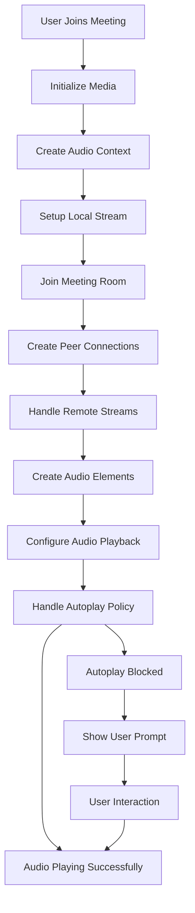
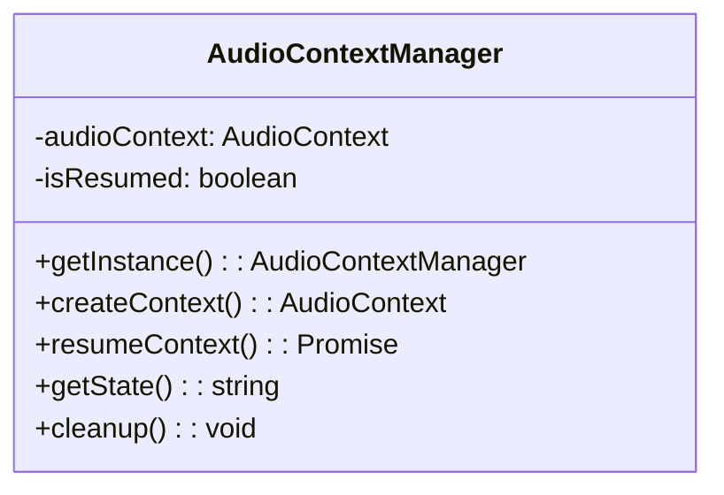
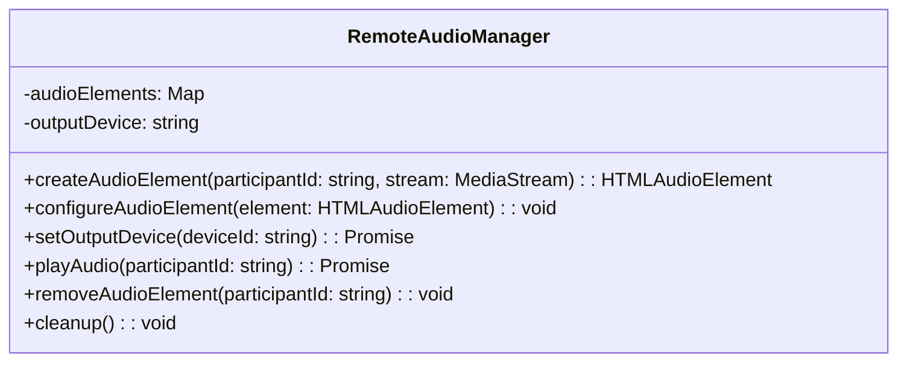
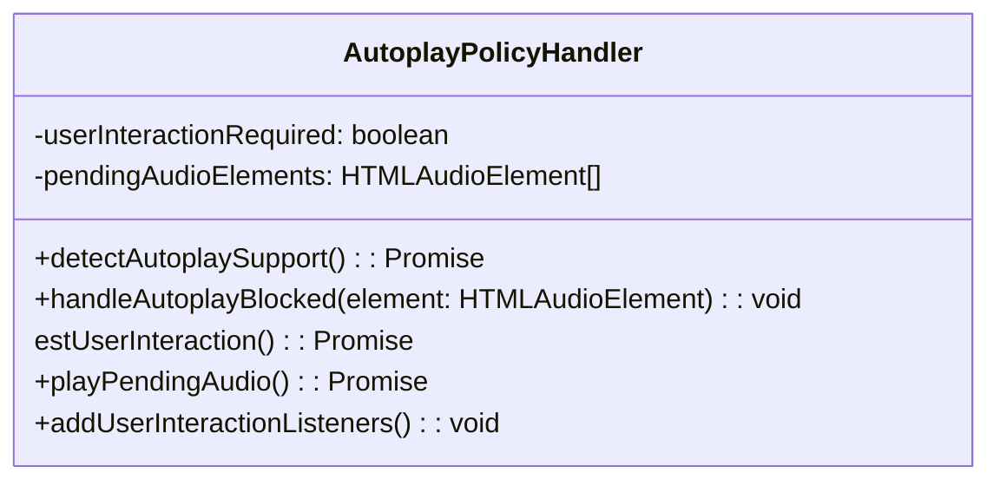
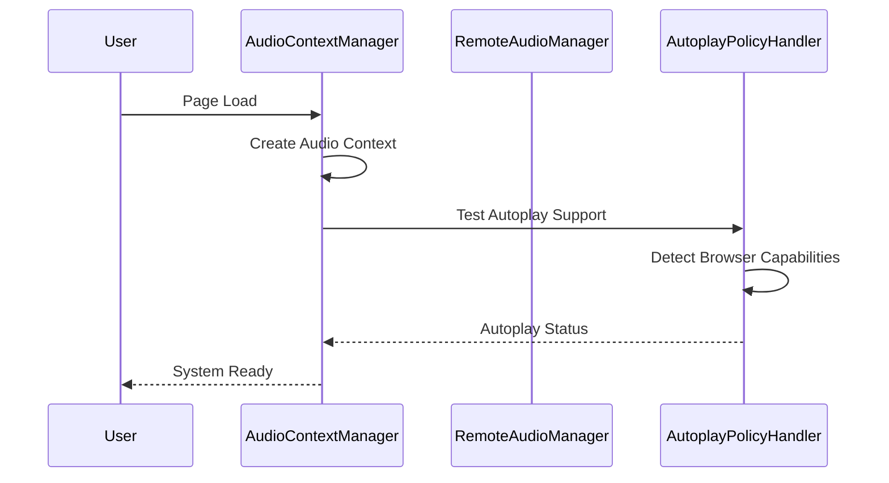
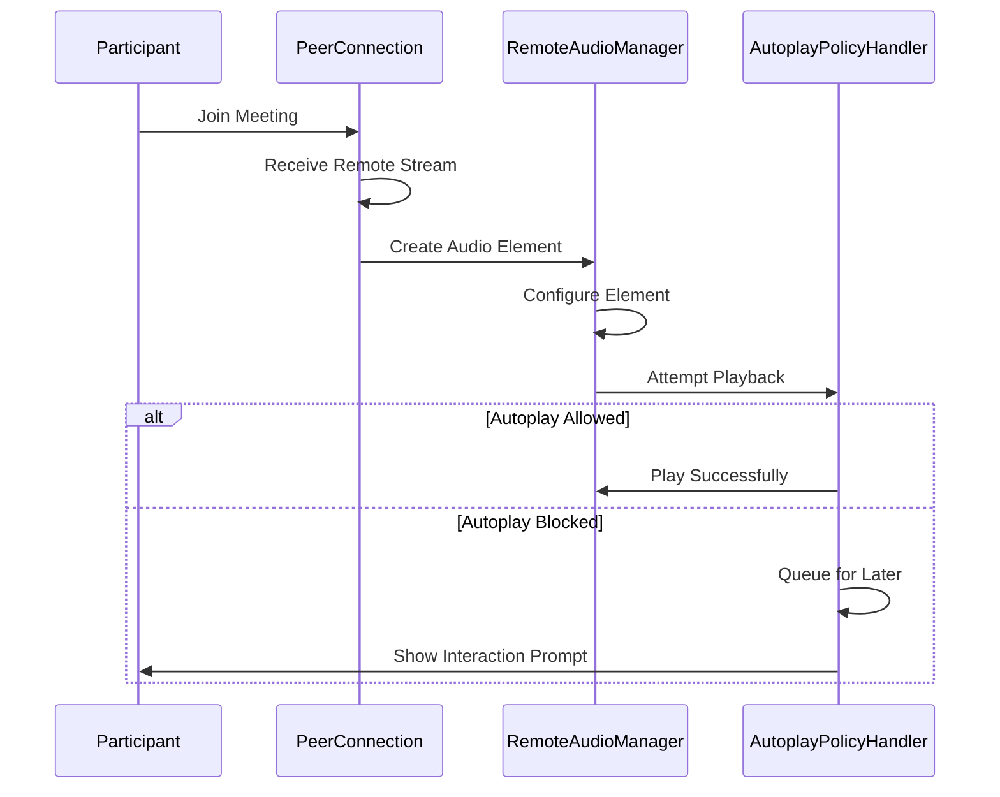
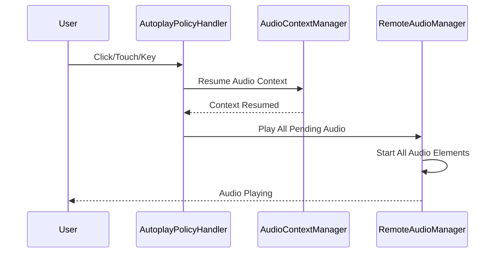

# Audio Output Fix Design Document

## Overview

This design document outlines the comprehensive solution for fixing audio output issues in the video conferencing system. The primary problem is that users cannot hear audio from other participants during meetings due to browser autoplay policies, improper audio element configuration, and inadequate audio context management.

## Architecture Overview



## Core Components

### 1. Enhanced Audio Context Manager

The audio context manager will be responsible for creating, managing, and resuming audio contexts across the application.



**Key Features:**
- Singleton pattern to ensure single audio context
- Automatic context resumption on user interaction
- State monitoring and management
- Proper cleanup on application exit

### 2. Remote Audio Element Manager

This component manages the lifecycle of audio elements for remote participants.



**Key Features:**
- Dedicated audio elements per participant
- Proper audio element configuration
- Output device management
- Automatic cleanup on participant leave

### 3. Autoplay Policy Handler

This component detects and handles browser autoplay restrictions.



**Key Features:**
- Autoplay capability detection
- User interaction requirement handling
- Batch audio playback after user gesture
- Clear user prompts and notifications

## Detailed Component Design

### Audio Context Management

The audio context will be managed globally to ensure consistent behavior:

1. **Context Creation**: Create a single AudioContext instance on application start
2. **State Monitoring**: Continuously monitor context state (running, suspended, closed)
3. **Automatic Resumption**: Resume context on any user interaction
4. **Error Handling**: Graceful fallback for unsupported browsers

### Remote Audio Element Configuration

Each remote participant will have a dedicated audio element with specific configuration:

```javascript
const audioElement = document.createElement('audio');
audioElement.autoplay = true;
audioElement.muted = false;  // Critical: Remote audio must NOT be muted
audioElement.volume = 1.0;   // Full volume
audioElement.controls = false;
audioElement.playsInline = true; // Required for Safari
```

### Autoplay Policy Handling Strategy

The system will implement a multi-layered approach to handle autoplay restrictions:

1. **Detection Phase**: Test autoplay capability on page load
2. **Graceful Degradation**: If autoplay fails, queue audio elements for later playback
3. **User Interaction**: Capture any user interaction to trigger audio playback
4. **Notification System**: Inform users when interaction is required

## Browser-Specific Considerations

### Chrome 66+ Handling

- **Media Engagement Index**: Track user engagement to improve autoplay success
- **User Gesture Requirements**: Ensure all audio playback follows user interaction
- **AudioContext Resumption**: Handle suspended contexts properly

### Safari Handling

- **playsinline Attribute**: Required for MediaStream audio playback
- **User Media Capturing**: Leverage existing capture permissions for autoplay
- **iOS Specific**: Handle mobile Safari restrictions

### Firefox Handling

- **Output Device Limitations**: Handle lack of setSinkId support gracefully
- **Autoplay Preferences**: Respect user's autoplay preferences

## Implementation Flow

### 1. Initialization Phase



### 2. Participant Join Flow



### 3. User Interaction Handling



## Error Handling and Recovery

### Common Error Scenarios

1. **AudioContext Suspended**: Automatically resume on user interaction
2. **Autoplay Blocked**: Queue audio and prompt user
3. **Device Not Found**: Fallback to default output device
4. **Permission Denied**: Provide clear instructions for enabling permissions
5. **Network Issues**: Implement retry logic with exponential backoff

### Recovery Strategies

1. **Automatic Retry**: Retry failed operations with increasing delays
2. **Fallback Mechanisms**: Use alternative approaches when primary methods fail
3. **User Guidance**: Provide clear instructions for manual resolution
4. **Diagnostic Tools**: Offer built-in debugging capabilities

## Performance Considerations

### Resource Management

1. **Audio Element Pooling**: Reuse audio elements when possible
2. **Memory Cleanup**: Proper disposal of audio elements and contexts
3. **Event Listener Management**: Clean up event listeners to prevent memory leaks
4. **Stream Management**: Proper handling of MediaStream lifecycle

### Optimization Strategies

1. **Lazy Loading**: Create audio elements only when needed
2. **Batch Operations**: Group audio operations to reduce overhead
3. **Efficient Event Handling**: Use event delegation where appropriate
4. **Resource Monitoring**: Track and limit resource usage

## Testing Strategy

### Unit Testing

1. **Audio Context Management**: Test context creation, resumption, and cleanup
2. **Audio Element Configuration**: Verify proper element setup
3. **Autoplay Detection**: Test autoplay capability detection
4. **Error Handling**: Test various error scenarios and recovery

### Integration Testing

1. **Cross-Browser Testing**: Test on Chrome, Safari, Firefox, Edge
2. **Device Testing**: Test with various audio input/output devices
3. **Network Conditions**: Test under different network conditions
4. **User Interaction Scenarios**: Test various user interaction patterns

### End-to-End Testing

1. **Multi-Participant Meetings**: Test with multiple participants
2. **Join/Leave Scenarios**: Test participant lifecycle
3. **Device Switching**: Test audio output device changes
4. **Permission Scenarios**: Test various permission states

## Security Considerations

### Privacy Protection

1. **Device Enumeration**: Only enumerate devices with proper permissions
2. **Audio Stream Access**: Ensure proper access controls for audio streams
3. **User Consent**: Clear consent for audio access and device selection
4. **Data Protection**: Secure handling of audio-related data

### Browser Security

1. **Content Security Policy**: Ensure compatibility with CSP restrictions
2. **Permissions API**: Proper use of permissions API where available
3. **Secure Context**: Ensure functionality works in secure contexts only
4. **Cross-Origin Restrictions**: Handle cross-origin audio restrictions

## Monitoring and Analytics

### Performance Metrics

1. **Audio Playback Success Rate**: Track successful audio playback
2. **Autoplay Success Rate**: Monitor autoplay policy impact
3. **User Interaction Requirements**: Track when user interaction is needed
4. **Error Rates**: Monitor various error types and frequencies

### User Experience Metrics

1. **Time to Audio**: Measure time from join to audio playback
2. **User Satisfaction**: Track user feedback on audio quality
3. **Support Requests**: Monitor audio-related support requests
4. **Feature Usage**: Track usage of audio debugging tools

## Future Enhancements

### Advanced Features

1. **Audio Quality Adaptation**: Automatic quality adjustment based on network
2. **Noise Cancellation**: Integration with browser noise cancellation APIs
3. **Spatial Audio**: Support for spatial audio positioning
4. **Audio Effects**: Real-time audio effects and filters

### Platform Improvements

1. **WebCodecs Integration**: Use WebCodecs for better audio processing
2. **WebAssembly Optimization**: Use WASM for performance-critical audio operations
3. **Service Worker Integration**: Offline audio capability
4. **Progressive Web App**: Enhanced PWA audio features